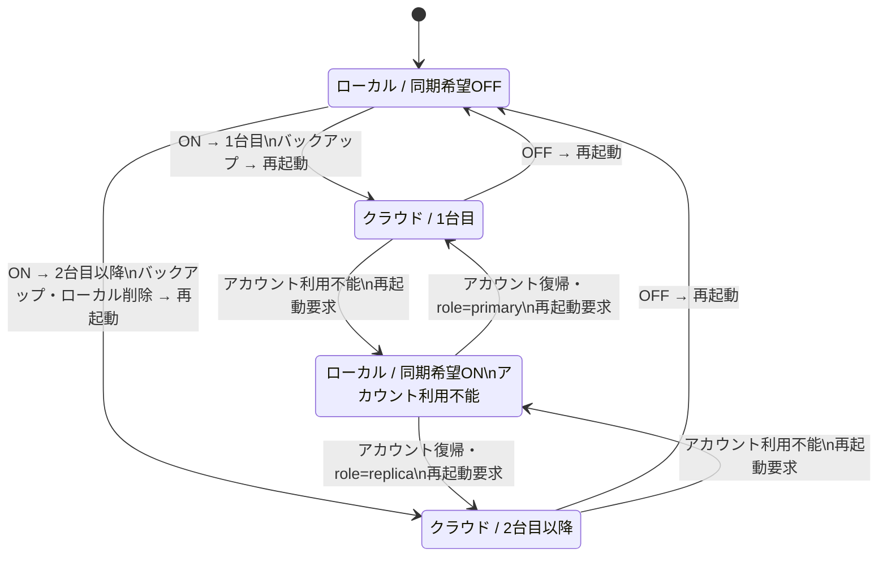

# iCloud設定画面 Windows移植仕様

## 1. 目的

本文書は、macOS版 ShelfRow の「設定 > iCloud」画面をWindows版へ移植するための仕様書である。画面の外観だけでなく、表示条件、状態遷移、確認ダイアログ、再起動を必要とする理由、同期サービスとの境界までを移植対象とする。

現行実装の参照元は主に次のファイルである。

- `ShelfRow/PreferencesView.swift` の `CloudSyncSettingsView`
- `ShelfRow/CloudAccount.swift` の `CloudAccountMonitor`
- `ShelfRow/LibraryStore.swift` の `LibraryStore`、`LibraryMode`、`CloudRole`
- `ShelfRow/CloudUploadBacklog.swift` の送信件数表示
- `ShelfRow/ShelfRowApp.swift` のアカウント監視、再起動後のクラウド削除

Windows版ではSwiftUI、CloudKit、`NSWorkspace`などを直接移植しない。画面が依存する状態と操作をインターフェースとして切り出し、Windows側の同期実装へ接続する。同期先としてiCloudを継続利用する場合も、画面コードがCloudKit固有APIを直接呼ばない構成にする。

## 2. 利用者に伝える基本概念

画面の冒頭では、次の3点を明確に伝える。

1. 同期対象は、本、シェルフ、ボリュームなどの書誌情報である。
2. サムネイルと書籍ファイルはiCloudへ送信しない。
3. 2台の蔵書をマージしない。1台目がクラウドへ送り、2台目以降はクラウドの蔵書でローカルを置き換える。

これは補足説明ではなく、誤操作による二重登録やローカル蔵書の消失を防ぐための中核仕様である。

## 3. 設定ウインドウ全体

### 3.1 macOS版の寸法

- ウインドウ: 860 × 600 pt
- 左ナビゲーション: 最小180 pt、基準190 pt
- 右ペイン: 縦スクロール
- 右ペイン内側余白: 24 pt
- セクション間隔: 20 pt
- 本文: 13 pt
- 補足: 12 pt
- セクション見出し: `title2`相当のセミボールド

### 3.2 Windows版の推奨対応

Windowsでは同じ数値をDIPとして扱い、最低860 × 600 DIPを基準にする。文字はSegoe UIを使用し、OSのテキスト拡大率に従う。右ペインは必ずスクロール可能にし、狭いウインドウや高い拡大率でも下部の危険操作と確認説明へ到達できるようにする。

左ナビゲーションの項目名は「iCloud」、アイコンはFluent Iconsのクラウド相当を用いる。Windows版の同期先名称を将来変更する場合は、文字列リソースの差し替えだけで対応できるようにする。

## 4. 右ペインの構成

上から次の順に並べる。

1. ページ見出し
2. 基本状態パネル
3. 全件再送信パネル（条件付き）
4. 全件再送信の結果メッセージ（条件付き）
5. iCloudデータ削除パネル（条件付き）
6. 削除結果メッセージ（条件付き）
7. 再起動要求バナー（条件付き）
8. マージしない旨の常設注記

### 4.1 ページ見出し

- 見出し: `iCloud`
- 説明:

> 本・シェルフ・ボリュームの書誌情報を、同じiCloudアカウントのMacやiPadと同期します。サムネイルと書籍ファイルはiCloudへ送信されません。

Windows版にWindows端末も含める場合は、プラットフォーム列挙を次のように変更してよい。

> 本・シェルフ・ボリュームの書誌情報を、同じアカウントのWindows PC、Mac、iPadと同期します。サムネイルと書籍ファイルはクラウドへ送信されません。

ただし、実際に相互運用できる端末だけを列挙する。

## 5. パネルと行の視覚仕様

各パネルは角丸8 DIP、薄いコントロール背景、1 DIPのセパレーター枠を持つ。行は次の3領域で構成する。

| 領域 | 仕様 |
|---|---|
| アイコン | 34 × 34 DIP。17 DIP程度のセミボールドアイコン。アクセント色12%程度の角丸背景 |
| 説明 | タイトル13 DIPセミボールド、説明12 DIP、行間2 DIP。複数行可 |
| 操作 | 右寄せ。スイッチ、ボタン、進捗リング、状態文字列を配置 |

行の水平余白は14 DIP、垂直余白は13 DIP、アイコンと本文の間隔は14 DIPとする。行間の区切り線はアイコンの左端ではなく、本文の開始位置付近から引く。現行版は左から48 ptの位置を開始点としている。

Windows版では横幅不足時に説明文を先に折り返し、操作部は切らない。高い文字拡大率では操作部を次の行へ落としてよい。

## 6. 基本状態パネル

基本状態パネルには、次の順で行を配置する。

### 6.1 「iCloud同期」行

- アイコン: クラウド
- タイトル: `iCloud同期`
- 説明:

> オフにするとこの端末だけで動作します。オフの間の変更は、次にオンにしたときにまとめて送信されます。

- 操作: `同期する` スイッチ

スイッチは現在の希望設定 `syncEnabled` を表す。現在ストアがクラウド接続で開いているかを表す `effectiveMode` とは別である。この2値を一つにまとめてはならない。アカウントが利用不能になった場合、希望設定はオンのままでも実効モードはローカルになり得る。

スイッチをオンへ動かした時点では値を確定せず、「どちらの蔵書を残しますか？」ダイアログを表示する。キャンセル時はオフのままとする。

スイッチをオフへ動かした時点でも値を確定せず、「iCloud同期をオフにしますか？」ダイアログを表示する。

#### 有効／無効条件

- 同期がすでにオンなら、アカウントが利用不能でもスイッチを操作可能にする。利用者がオフへ戻せなくなるのを防ぐためである。
- 同期がオフの場合、アカウントが利用可能なときだけオンへ変更できる。
- バックアップ、全件再送信などの排他処理 `blockingTask` がある間は無効にする。

論理式は次のとおりである。

```text
canToggle = syncEnabled OR accountAvailability == available
isToggleEnabled = canToggle AND blockingTask == null
```

### 6.2 「状態」行

- アイコン: 認証済みを示すシール／チェック
- タイトル: `状態`
- 操作: `更新` ボタン

説明文はアカウント状態から生成する。

| 状態値 | 表示文言 |
|---|---|
| checking | iCloudの状態を確認中… |
| available | 利用可能 |
| noAccount | iCloudにサインインしていません |
| restricted | iCloudの利用が制限されています |
| unavailable(reason) | iCloudを利用できません: {reason} |

画面表示時に自動更新を1回実行する。`更新`ボタンでは同じ照会を手動実行する。照会中は直前状態を残すのではなく、必要に応じて`checking`を表示できる設計にする。

### 6.3 「アカウント」行

- アイコン: ユーザー
- タイトル: `アカウント`
- 操作: `コピー`（IDがある場合のみ）、`システム設定`

ID取得済みの説明:

> ID: {accountID}
> 同じiCloudアカウントの端末では同じIDになります。メールアドレスはiCloudの仕様によりアプリからは取得できません。

ID未取得の説明:

> サインインすると、このアカウントのIDを表示します。

`コピー`はID文字列だけをクリップボードへ入れる。メールアドレスや表示名を推測して表示しない。`システム設定`はWindows側で利用している同期プロバイダーのアカウント設定、またはサインイン画面を開く。macOS固有のApple ID設定URIをそのまま移植しない。

### 6.4 「現在のモード」行

- アイコン: 接続済みドライブ
- タイトル: `現在のモード`
- 右側: 実効モード文字列をセカンダリ色で表示
- 説明: 最終同期または排他処理の状態

実効モードの表示は次のとおりである。

| 条件 | 表示 |
|---|---|
| effectiveMode = cloud、role = primaryまたは未設定 | クラウド（iCloudと同期中） |
| effectiveMode = cloud、role = replica | クラウド（iCloudと同期中・2台目以降） |
| effectiveMode = local、syncEnabled = false | ローカル |
| effectiveMode = local、syncEnabled = true | ローカル（iCloudを利用できないため） |

説明文の優先順位:

1. `blockingTask`がある: `「{taskName}」の実行中は切り替えできません。`
2. 最終同期日時がない: `まだ同期していません。`
3. 最終同期日時がある: `最終同期: {ローカル形式の日時}`

### 6.5 「同期の進行」行

実効モードが`cloud`のときだけ表示する。

- アイコン: 同期
- タイトル: `同期の進行`
- 同期中の操作部: 小型の円形インジケーター
- 同期停止中の操作部: `送受信完了`

件数が取得できる場合の説明:

> 未送信 {pending}件 / 送信済み {uploaded}件 / この端末 {held}件

取得できない場合の説明:

> iCloudとの送受信の状態です。

`pending`はこの端末からまだ送られていない同期レコード、`uploaded`は送信済みレコード、`held`はこの端末が現在保持する同期対象オブジェクトの合計である。受信予定総数は端末側で事前に分からないため表示しない。

進捗バーの割合は表示しない。同期サービスが総件数を保証しない場合、確定割合を作ると途中で100%に見えるためである。同期中判定は次を使う。

```text
isSyncing = pendingUploads > 0 OR receivingSyncRounds
```

受信イベントが止まってから90秒間は`receivingSyncRounds`を維持し、クラウド側の短い待機を完了と誤認しない。送信件数の取得は画面表示中かつクラウドモードの間だけ5秒ごとに行い、画面を離れたら停止する。

## 7. 全件再送信

### 7.1 表示条件

次をすべて満たす場合だけ表示する。

- 実効モードが`cloud`
- この端末の役割が`primary`（1台目）または役割未設定

`replica`（2台目以降）では表示しない。2台目はクラウドの内容を受け取る側であり、クラウド全体へ再送信する権限を持たせない。

### 7.2 行の仕様

- タイトル: `iCloudへ全件を再送信`
- 説明:

> この端末の蔵書をすべて送信待ちに入れ直します。「未送信 0件」なのにiCloudや他の端末に蔵書が揃っていないときに使います。蔵書の内容は変わりません。

- 通常時ボタン: `全件を送信待ちに入れる…`
- 実行中: ボタンを小型円形インジケーターへ置換

アカウントが利用不能、または`blockingTask`実行中はボタンを無効にする。

### 7.3 確認ダイアログ

タイトル:

> 蔵書をすべて送信待ちに入れますか？

本文:

> この端末の蔵書をすべてiCloudへの送信待ちに入れ直します。蔵書の内容は変わらず、失われるものもありません。
> 件数が多いと送信には時間がかかります。準備中はアプリの動作が重くなることがあります。
> 他の端末で受け取るには、送信が終わってから「iCloudの蔵書で置き換える」を実行してください。

ボタン:

- `全件を送信待ちに入れる`
- `キャンセル`

### 7.4 結果表示

パネル直下に12 DIPのセカンダリ文字で表示する。

- 成功: `{queued}件をiCloudへの送信待ちに入れました。送信が終わるまでこのままにしてください。`
- 失敗: `再送信の準備に失敗しました: {error}`

## 8. iCloudデータの完全削除

### 8.1 表示条件

この端末が`replica`でない場合だけ表示する。ローカルモードでも、1台目または役割未設定なら表示する。アカウントが利用不能、または`blockingTask`実行中はボタンを無効にする。

### 8.2 行の仕様

- タイトル: `iCloudのデータを削除`
- 説明:

> このアプリがiCloudに保存している書誌情報をすべて消し、使用しているiCloudの容量を解放します。この端末の蔵書・サムネイル・設定は残ります。

- 破壊的操作ボタン: `iCloudから完全に削除…`

WindowsではFluentの危険操作スタイルを使用し、通常のアクセントボタンと区別する。

### 8.3 確認ダイアログ

タイトル:

> iCloudのデータをすべて削除しますか？

本文:

> iCloudに保存されているこのアプリの書誌情報をすべて削除し、使用中のiCloud容量を解放します。削除は取り消せません。
> この端末の蔵書・サムネイル・設定は残ります。iCloud同期はオフになります。
> 他の端末で同期をオンにしたままだと、その端末が同じ内容を再びアップロードします。先にすべての端末で同期をオフにしてください。
> 削除はアプリの再起動後に実行されます。

ボタン:

- `削除して再起動`（破壊的操作）
- `キャンセル`

### 8.4 実行順序

削除ボタン押下時にクラウドを即時削除してはならない。

1. `syncEnabled = false`
2. 次回起動時の削除フラグを保存
3. 端末の役割を未設定へ戻す
4. 次回モードをローカルとして保存
5. アプリを再起動
6. ローカルモードでストアを開く
7. 同期エンジンがクラウドへ再アップロードできない状態で、アプリ専用クラウド領域を削除

成功後は次を表示する。

- データがあった: `iCloudのデータを削除しました。使用していた容量は解放されます。`
- データがなかった: `iCloudにこのアプリのデータはありませんでした。`
- 失敗: `iCloudのデータを削除できませんでした: {error}`

## 9. 同期をオンにするフロー

### 9.1 最初の選択ダイアログ

タイトル:

> どちらの蔵書を残しますか？

本文:

> どちらを選んでもアプリが再起動します。
> 1台目を選ぶと、この端末の蔵書がiCloudへ送られます。
> 2台目以降を選ぶと、この端末の蔵書とボリュームのアクセス権は削除され、iCloudの内容に置き換わります。削除は取り消せません。置き換えはアプリの再起動後に行われ、同期が終わるまで蔵書は空に見えます。
> すでにiCloudに蔵書がある状態で「1台目」を選ぶと、同じ本が二重に登録されます。

ボタン:

- `この端末の蔵書をiCloudへ送る（1台目）`
- `iCloudの蔵書で置き換える（2台目以降）`（破壊的操作）
- `キャンセル`

Windows版でも「1台目」「2台目以降」の表現を維持する。技術用語の`primary`、`replica`は画面に表示しない。

### 9.2 1台目を選んだ場合

1. モード切り替え前バックアップを作成する。
2. バックアップ失敗時は設定を変更せず、再起動もしない。
3. `syncEnabled = true`を保存する。
4. 役割を`primary`として保存する。
5. 次回モードを`cloud`として保存する。
6. 新しいアプリプロセスを起動し、現在のプロセスを終了する。
7. 再起動後、既存のローカル蔵書をクラウドへ送信する。

### 9.3 2台目以降を選んだ場合

1. モード切り替え前バックアップを作成する。
2. `syncEnabled = true`を保存する。
3. ローカル蔵書の削除予約と、バックアップ済みフラグを保存する。
4. 役割を`replica`として保存する。
5. 次回モードを`cloud`として保存する。
6. アプリを再起動する。
7. 古いプロセスが完全に終了するまで待つ。
8. データベースを開く前にローカル蔵書ストアをファイル単位で削除する。
9. 空のストアをクラウド接続で開き、受信を待つ。

行単位の削除を同期エンジンへ流してはならない。削除イベントがクラウドへ伝播し、全端末の蔵書を消すおそれがあるためである。

書籍ファイルへのアクセス権は端末固有である。2台目の置き換え後は、ボリュームのアクセス権をその端末で再設定する必要がある。サムネイルキャッシュはローカルに残す。

## 10. 同期をオフにするフロー

タイトル:

> iCloud同期をオフにしますか？

本文:

> この端末の蔵書はそのまま残り、iCloudへの送信だけを止めます。iCloud側の蔵書も消えません。反映にはアプリの再起動が必要です。

ボタン:

- `オフにして再起動`
- `キャンセル`

確定後は`syncEnabled = false`、次回モードを`local`として保存し、アプリを再起動する。ローカルの変更履歴や未送信データは消さない。再びオンにしたときに送信対象となる。

## 11. 再起動要求バナー

アカウントのサインイン／サインアウトなどで、現在開いているモードと次回必要なモードが一致しなくなった場合に表示する。

- 色: オレンジ系
- アイコン: 再起動
- 文言: `再起動すると新しい設定で開きます。`
- ボタン: `今すぐ再起動`

アカウント状態の変化だけで利用中のアプリを自動終了してはならない。バナーで知らせ、利用者が操作するか次回通常起動時に反映する。

再起動処理は、新しいプロセスを起動してから現在のプロセスを終了する。Windows側では単一インスタンス制御とDBロック解放を考慮し、新プロセスが古いプロセスの終了を待てる仕組みにする。

## 12. 常設注記

画面下部に12 DIPのセカンダリ文字で常に表示する。

> 2台の蔵書を突き合わせる処理は行いません。1台目でiCloudへ送り、2台目以降はiCloudの蔵書で置き換える、という使い方になります。

この注記は同期がオフでも表示する。オンにする前に運用方式を理解できる必要があるためである。

## 13. 状態モデル

Windows版のViewModelは、最低限次の読み取り状態を公開する。

```text
SyncSettingsState
  syncEnabled: Bool                 // 利用者の希望
  effectiveMode: local | cloud      // 現在DBを開いている方式
  deviceRole: unknown | primary | replica
  accountAvailability:
    checking | available | noAccount | restricted | unavailable(reason)
  accountID: String?
  lastSyncAt: DateTime?
  pendingUploads: Int?
  uploadedRecords: Int?
  heldRecords: Int?
  receivingSyncRounds: Bool
  blockingTask: String?
  isResending: Bool
  resendMessage: String?
  purgeMessage: String?
  restartRequired: Bool
```

画面から呼ぶ操作は次のインターフェースにまとめる。

```text
refreshAccount()
enableAsPrimary() -> Result
enableAsReplica() -> Result
disableSync()
queueFullResend() -> Result<queuedCount>
requestCloudPurge()
copyAccountID()
openAccountSettings()
restartApplication()
```

ViewModelはUIスレッドで状態を公開し、アカウント照会、バックアップ、件数集計、クラウド削除、全件再送信はバックグラウンドで行う。状態更新だけをUIスレッドへ戻す。

## 14. 表示条件一覧

| UI要素 | 表示条件 | 無効条件 |
|---|---|---|
| 同期スイッチ | 常時 | `(!syncEnabled && account != available) || blockingTask != null` |
| 更新 | 常時 | 原則なし。連打防止は可 |
| アカウントIDコピー | `accountID != null` | なし |
| システム設定 | 常時 | OS側に導線がない場合のみ無効 |
| 同期の進行 | `effectiveMode == cloud` | なし |
| 全件再送信 | `effectiveMode == cloud && role != replica` | account unavailable、blocking task中 |
| iCloudデータ削除 | `role != replica` | account unavailable、blocking task中 |
| 再起動バナー | `restartRequired == true` | なし |
| 常設注記 | 常時 | なし |

## 15. 状態遷移



`syncEnabled`と`effectiveMode`を別に持つことで、アカウントが一時的に使えない間も利用者の希望を保持し、復帰後に同期を再開できる。

## 16. 永続化する値

macOS版と同じ意味で次を端末ローカルに保存する。Windows版でキー名を合わせる必要はないが、意味を変えてはならない。

| 値 | macOS版キー | 用途 |
|---|---|---|
| 同期希望 | `iCloudSyncEnabled` | UIスイッチの値 |
| 前回／次回実効モード | `libraryLastEffectiveMode` | 起動時にローカル／クラウドのどちらでDBを開くか |
| ローカル置換予約 | `libraryPendingResetFromCloud` | 次回起動前にローカル蔵書を削除する |
| 置換前バックアップ済み | `libraryPendingResetBackupReady` | 再起動後の重複バックアップを避ける |
| クラウド削除予約 | `libraryPendingCloudPurge` | ローカルモード起動後にクラウドを削除する |
| 端末の役割 | `libraryCloudRole` | primary／replicaの権限制御 |

これらは認証トークンではない。同期サービスのアクセストークンや秘密情報はWindows Credential Managerなどの安全な資格情報ストアへ保存する。

## 17. 同期対象と端末固有データ

同期対象:

- Item（本）
- Shelf（シェルフ）
- Volume（ボリュームの書誌上の定義）
- CoverExtractionRecord（表紙抽出結果の書誌情報）

同期しないもの:

- 書籍ファイル本体
- サムネイル画像
- ファイルアクセス権／Security-Scoped Bookmark相当
- この端末が保持するサムネイル版の状態

Windows版でもファイルアクセス権やローカルパスは端末固有ストアへ分離する。別端末のパスや資格情報で上書きしない。

## 18. Windows固有の置換点

| macOS実装 | Windows版 |
|---|---|
| SwiftUI `NavigationSplitView` | WinUI 3 `NavigationView`または同等の左ナビゲーション |
| `Toggle(.switch)` | `ToggleSwitch` |
| `ProgressView(.circular)` | `ProgressRing` |
| `confirmationDialog` | `ContentDialog`。破壊的操作は危険色 |
| `NSPasteboard` | Windows Clipboard API |
| Apple ID設定URI | 同期プロバイダーのアカウント設定／サインイン画面 |
| `NSWorkspace.openApplication` | 新プロセス起動 + 現プロセス終了 |
| `UserDefaults` | ローカル設定ストア |
| Keychain | Windows Credential Manager |
| CloudKitイベント | Windows同期アダプターの送受信イベント |

危険操作の確認順、表示条件、バックアップ、再起動境界はOS固有部分ではないため、そのまま維持する。

## 19. アクセシビリティ

- すべてのスイッチとボタンに可視ラベルとAutomationProperties.Nameを付ける。
- 状態説明は色だけで区別しない。
- 進捗リングには`同期中`、完了文字列には`送受信完了`を読み上げ値として設定する。
- 破壊的ボタンは危険色だけでなく、ラベル本文に`削除`を含める。
- キーボードのTab順は上から下、各行では説明の後に操作部とする。
- ダイアログ表示時は初期フォーカスをキャンセルまたは安全な選択肢へ置く。2台目の置換やクラウド削除を既定ボタンにしない。
- 200%のテキスト拡大でも本文、操作、結果メッセージが欠けないことを確認する。

## 20. エラーと待機状態

- バックアップ失敗時は同期設定を変更しない。
- アカウントID取得だけが失敗しても、アカウント自体が利用可能なら同期操作は許可する。
- 同期サービスのレート制限や一時停止は失敗として扱わず、待機後に自動再開する。
- 全件再送信とクラウド削除の結果は画面内に残し、ダイアログだけで通知しない。
- アプリ再起動が必要な変更は、再起動前に永続化する。
- 再起動後の置換または削除に失敗した場合、ローカル蔵書を保持し、利用者へ原因を表示できる状態を残す。

現行macOS画面は内部に保持している同期エラー詳細とレート制限終了時刻を直接表示していない。Windows版で表示を追加する場合は機能改善として扱い、macOS版との画面差分を明記する。

## 21. 受け入れ条件

### 21.1 表示

- ローカル／クラウド、1台目／2台目、アカウント利用可否の組み合わせで、表14の条件どおりに項目が表示される。
- 2台目では全件再送信とクラウド削除が表示されない。
- クラウドモードでだけ同期進行が表示される。
- 高DPI、200%文字拡大、860 × 600 DIPで全項目へスクロールできる。

### 21.2 操作

- オン操作をキャンセルすると同期希望は変わらない。
- 1台目／2台目のどちらでも、バックアップ成功後にだけ設定が確定する。
- 2台目ではDBを開く前にローカル蔵書を置き換え、行削除をクラウドへ同期しない。
- オフ操作後もローカル蔵書とクラウド側データが残る。
- クラウド削除はローカルモードで再起動した後にだけ実行される。
- アカウント利用不能でも、同期希望がオンならオフ操作が可能である。
- 排他処理中はモード変更と危険操作ができない。

### 21.3 進捗

- 画面表示中だけ5秒間隔で件数を更新する。
- 画面を離れると監視を停止する。
- 未送信が1件以上なら同期中表示になる。
- 受信イベント中は未送信0件でも同期中表示になる。
- 受信イベント終了後の短い無通信を完了と誤認しない。

### 21.4 再起動と復旧

- アカウント状態変化だけでは自動再起動しない。
- 再起動バナーから安全に新プロセスへ引き継げる。
- 古いプロセスがDBを閉じる前にストアを削除しない。
- 置換前バックアップが失敗した場合はローカル蔵書を削除しない。

## 22. 実装上の優先順位

1. 状態モデルと同期サービスの抽象インターフェース
2. ローカル／クラウドの起動モード分離
3. 1台目／2台目の選択、バックアップ、再起動
4. 基本状態パネル
5. 同期イベントと進捗表示
6. 全件再送信
7. クラウド完全削除
8. アクセシビリティと高DPI検証

画面だけを先に作る場合も、`syncEnabled`、`effectiveMode`、`deviceRole`を一つのBooleanへ簡略化しない。後から同期処理を接続したときに、サインアウト、2台目、再起動待ちを正しく表現できなくなるためである。
